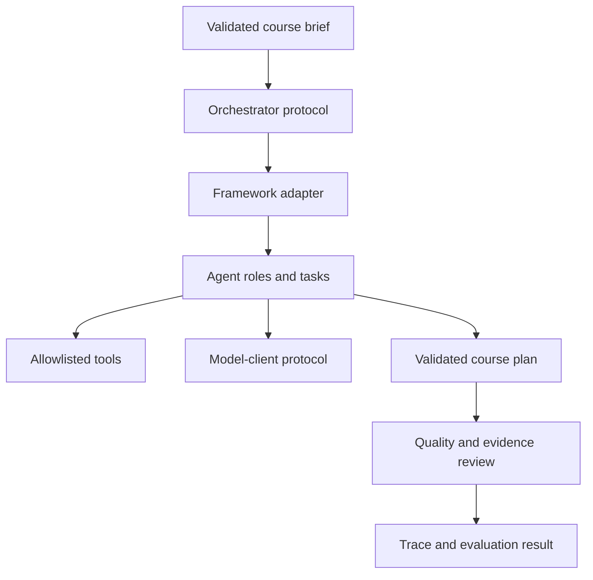

# Architecture

## Design principle

The course-intelligence domain is the stable centre of the system. Frameworks
are replaceable orchestration adapters around it. This is similar to comparing
four instructors who receive the same case, reference package, marking scheme,
and time limit: only their method of organizing the work should differ.

## Logical layers

1. **Interface layer** receives a validated task and presents the result.
2. **Orchestration adapter** expresses collaboration in a particular framework.
3. **Domain layer** holds framework-neutral models and validation rules.
4. **Capability layer** provides allowlisted retrieval, analysis, and formatting
   tools.
5. **Model gateway** normalizes Ollama and optional cloud-client behaviour.
6. **Evaluation layer** records traces, metrics, rubric scores, and failures.

## Data flow

## Initial conceptual roles

These roles describe responsibilities, not Phase 0 implementations:

| Role | Responsibility | May not do |
|---|---|---|
| Requirements analyst | extract scope, constraints, and uncertainties | invent missing policy |
| Curriculum designer | propose outcomes and weekly sequence | approve its own final work |
| Assessment specialist | align assessment with outcomes | grade real students |
| Evidence reviewer | verify claims and source links | silently rewrite evidence |
| Quality coordinator | consolidate findings and request revision | bypass human approval |

Frameworks may represent these responsibilities as chains, graph nodes, role
agents, or conversational participants, but the responsibilities remain fixed.

## Stable contracts

- `ModelClient`: converts a validated request into a model response.
- `Orchestrator`: runs one course-intelligence task and returns a validated result.
- Domain models: provide the shared serialized input/output format.
- `RunTrace`: captures comparable execution evidence.

Protocols use structural typing so future adapters are not forced to inherit
from a project-specific base class.

## Model independence

Model selection is configuration, not orchestration logic. Fair framework
comparisons use the same model, sampling settings, prompts where practical,
and execution limits. Cloud runs are reported separately from local runs.

## Failure strategy

Expected failure classes are validation failure, unavailable model, tool denial,
timeout, malformed structured output, exhausted turn limit, and review rejection.
Adapters must return structured failure information instead of hiding exceptions
or endlessly retrying.

## Observability

Each run receives a trace identifier. Measurements include framework and model,
start/end time, steps, messages, tool calls, validation errors, retries, human
interventions, latency, and token/cost estimates when available. Secrets and
unnecessary source content are excluded from traces.

## Phase 0 boundary

Phase 0 defines contracts and validates data. It contains no real model client,
tool implementation, workflow engine, or framework adapter.
